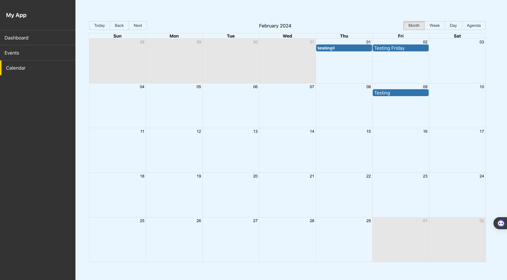

# Event Scheduling application.
"The Event Shedular project is a simple calendar application built using React, React-Redux and the react-big-calendar library. This project allows users to view and manage events within a calendar interface.

Features
Event Management: Users can add, edit, and delete events directly within the calendar interface.
Date Selection: Supports selection of dates and time slots for creating new events.
Event Styling: Events are styled differently based on their start dates, with past events displayed with a strikethrough style.
Local Storage: Events are persisted using the browser's local storage, ensuring that user data is retained between sessions.
Technologies Used
React: The project is built using the React JavaScript library, allowing for efficient and scalable UI development.
react-big-calendar: This library provides the core calendar functionality, including event rendering, date selection, and view customization.
Moment.js: Used for date and time manipulation, allowing for easy handling of dates and time zones.
CSS Styling: Custom styling is applied to the calendar interface using CSS files.
Usage
Viewing Events: Users can view existing events within the calendar interface. Events are displayed with different styling based on their start dates.
Adding Events: Users can click on available time slots to add new events. Only dates in the present or future are selectable for event creation.
Editing Events: Clicking on an existing event opens a modal window, allowing users to edit event details such as the title and date.
Deleting Events: Events can be deleted by clicking on the delete button within the event modal window.
"





## Built With

- JSX, CSS,JavaScript, React,Redux, Redux Toolkit, React Hooks, React-Big-Calendar,moment,localstorage
- Visual Studio, Git, & GitHub;


## Getting Started

To run this project, you only need a computer with a browser (like Google Chrome, Mozilla Firefox, Microsoft Edge, Apple Safari, etc.) installed, and follow these steps:

1. In your terminal, in the folder of your preference, type the following bash command to clone this repository:

```sh
git@github.com:fortuneonyeka/scheduler-with-redux.git
```

2. Now that you have already cloned the repo run the following commands to get the project up and running:
```sh
cd scheduler-with-redux
npm install
npm start / yarn start
npm run test
```

3.  You can start schedulling events by going to the calendar page and clicking on the date of your choice.

4.  All the changes will be automatically updated on your local server on http://localhost:3000/. You can stop your local server at any time hitting `<Ctrl> + C` on your keyboard.

3. To run Test:
```sh
npm run test
```


## Author

👤 **Ihedoro Fortunatus O**

- GitHub: [@fortuneonyeka](https://github.com/fortuneonyeka)
- Twitter: [@onyekafortune](https://twitter.com/onyekafortune)
- LinkedIn: [Ihedoro Fortunatus](https://www.linkedin.com/in/fortunatus-ihedoro/)

## 🤝 Contributing

Contributions, issues, and feature requests are welcome!

## Show your support

Give a ⭐️ if you like this project!